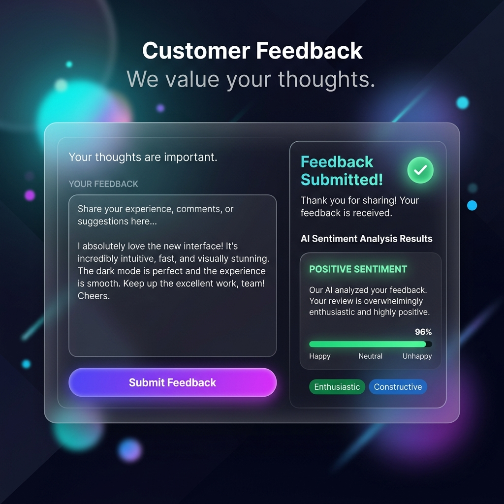
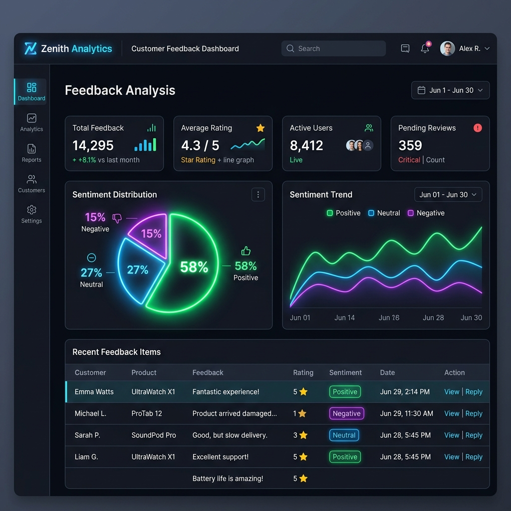

# AI Feedback Analyzer

AI Feedback Analyzer is a full-stack web application designed for customer feedback submission, automatic AI categorization, sentiment parsing, and comprehensive admin analysis. The system communicates with the OpenRouter Chat Completions API using a Llama-3 instruction model, processes the feedback, and saves structured findings to a Microsoft SQL Server database.

---

## Technical Architecture & Documentation
Detailed documentation is stored in the `docs/` folder:
- [Architecture Overview](./docs/architecture_overview.md) — Layered architecture outline, technology roles, and structural diagram.
- [API Contracts](./docs/api_contracts.md) — Full API request and response bodies for auth and feedback routes.
- [Data Flow / Sequence Diagrams](./docs/data_flow.md) — Sequence charts showing registry, feedback analysis, and admin aggregations.
- [Assumptions Made](./docs/assumptions.md) — System configurations, hashing configurations, database mappings, and fallbacks.

---

## Tech Stack Used

### Frontend
- **Framework**: Angular 21 (TypeScript, standalone components)
- **Styling**: Modern CSS (featuring responsive layout, custom palettes, glassmorphism)

### Backend
- **Framework**: ASP.NET Core Web API (.NET 10)
- **Language**: C#

### Database
- **Provider**: Microsoft SQL Server
- **Data Access**: ADO.NET using `Microsoft.Data.SqlClient` and Parameterized Stored Procedures

### AI Integration
- **API Provider**: OpenRouter Chat API
- **AI Model**: `meta-llama/llama-3-8b-instruct`

---

## Setup Instructions

### 1. Install Dependencies

**Frontend**:
```powershell
cd frontend
npm install
```

### 2. Configure Database & APIs
Update database connection strings and OpenRouter API credentials in the backend configurations file:

**File**: `backend/FeedbackAPI/appsettings.json`
```json
{
  "ConnectionStrings": {
    "DefaultConnection": "Server=YOUR_SERVER;Database=AIFeedbackDB;Trusted_Connection=True;TrustServerCertificate=True;"
  },
  "OpenRouter": {
    "ApiKey": "YOUR_OPENROUTER_API_KEY",
    "BaseUrl": "https://openrouter.ai/api/v1/chat/completions",
    "Model": "meta-llama/llama-3-8b-instruct"
  }
}
```

---

## How to Run API

1. Navigate to the backend project folder:
   ```powershell
   cd backend/FeedbackAPI
   ```
2. Launch the Web API project:
   ```powershell
   dotnet run
   ```
   - **Local URL**: `http://localhost:5048`
   - **Swagger Documentation**: `http://localhost:5048/swagger`

---

## How to Run UI

1. Navigate to the frontend project folder:
   ```powershell
   cd frontend
   ```
2. Start the local development server:
   ```powershell
   npm start
   ```
   - **App URL**: `http://localhost:4200`
   - **Target API Proxy**: `http://localhost:5048/api`

---

## How to Run Tests

### Backend Unit Tests
We use xUnit for backend test suites.
To run the C# unit tests:
```powershell
cd backend/FeedbackAPI.Tests
dotnet test
```

### Frontend Unit Tests
We use Jasmine/Karma framework.
To run the Angular unit tests:
```powershell
cd frontend
npm test
```

---

## Sample Screenshots

### Customer Feedback Form


### Admin Analysis Dashboard

