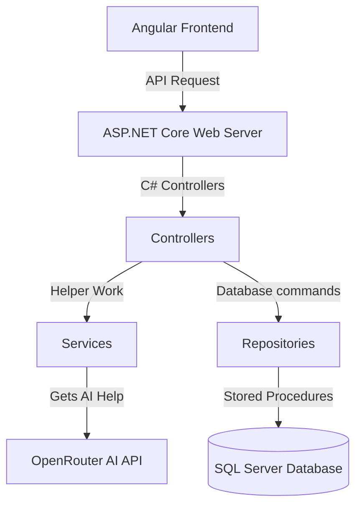

# Architecture Overview (Simple Guide)

This application is split into three simple layers that talk to each other:

1. **Frontend (What the user sees)** - Built using Angular.
2. **Backend (The server)** - Built using ASP.NET Core.
3. **Database (Where data is saved)** - Built using SQL Server.

Here is a simple map of how they talk to each other:

---

## 1. The Frontend (Angular)
- This is the website UI that runs inside the user's web browser.
- It displays the registration/login forms and the user dashboard where customers type reviews.
- It also displays the admin dashboard where we show charts (pie charts) and statistics about feedback.

## 2. The Backend (ASP.NET Core Server)
- This is the C# server that runs on your computer. It receives requests from the frontend and performs work.
- It is organized into 3 simple parts:
  - **Controllers**: Receives the request from the web browser.
  - **Services**: Performs extra work like hashing passwords or calling the AI.
  - **Repositories**: Runs SQL commands to save or get data from the database.

## 3. The Database (SQL Server)
- This is where all the registered customers and review data are saved.
- We use **Stored Procedures** (saved SQL commands) to insert and retrieve data safely.

## 4. AI Helper (OpenRouter API)
- When a customer submits feedback, the server sends the review text to an AI model (`meta-llama/llama-3-8b-instruct`).
- The AI reads the review and returns if it is positive/negative/neutral, a short summary, and a category.
- The server then saves this information in the database.
