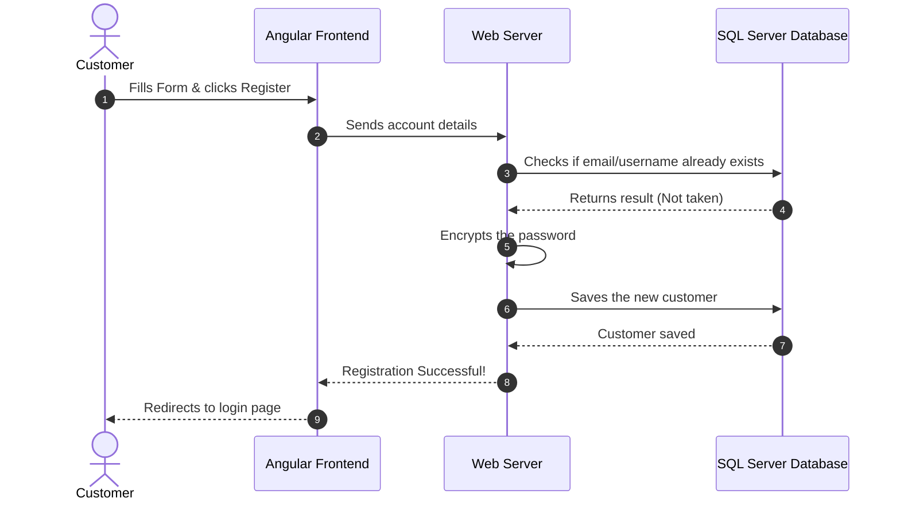
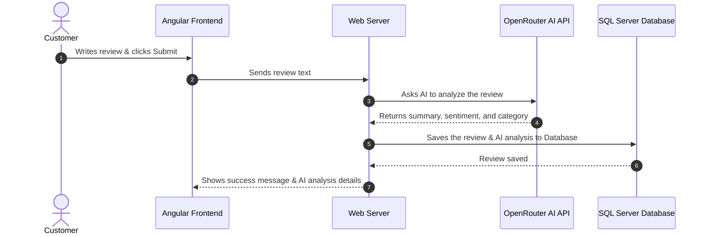
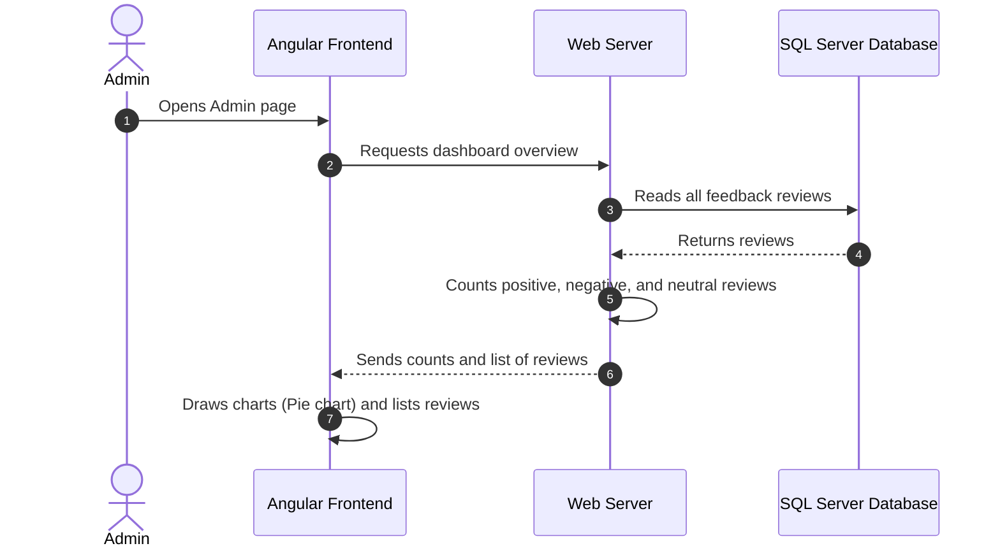

# Data Flow & Sequence Diagrams (Simple Guide)

This guide shows how data moves between the Frontend, Backend Server, and SQL Database for the three main features.

---

## 1. Registering a New Account
Here is the step-by-step order of what happens when a user clicks "Register":
1. **Frontend** sends the form details (username, password, email) to the **Server**.
2. **Server** asks the **Database** if this username or email is already taken.
3. If the username is **new**, the server **hashes (encrypts)** the password so it is safe.
4. The server runs the database query to **insert** the customer.
5. The server sends back a success message to the customer.

---

## 2. Submitting Feedback & Getting AI Analysis
Here is what happens when a customer types a review and clicks "Submit":
1. **Frontend** sends the review text to the **Server**.
2. **Server** forwards the review text to the **OpenRouter AI API**.
3. **AI** analyzes the text and returns a summary, category, and sentiment (Positive, Negative, or Neutral).
4. **Server** takes the AI results and runs the database stored procedure to **save** the review.
5. **Server** sends the saved details and AI analysis back to the webpage to show the customer.

---

## 3. Loading the Admin Dashboard
Here is how the admin dashboard displays information:
1. **Admin** opens the dashboard.
2. **Frontend** sends a request to get the dashboard summary.
3. **Server** runs a SQL query to get all feedback reviews from the database.
4. **Server** counts how many positive, negative, and neutral reviews exist.
5. **Server** sends these statistics and list of reviews to the frontend.
6. **Frontend** uses these counts to draw charts (like a pie chart) for the admin.

